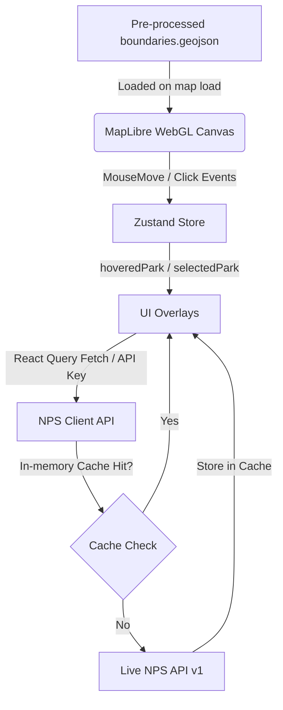

# NPS Explorer

[](https://nps-explorer.vercel.app)


NPS Explorer is a cinematic, dark-mode, map-first web application that renders all 433 National Park Service (NPS) managed units across the United States as WebGL boundary polygons. The application is completely serverless, communicating directly with MapTiler Cloud and the NPS API directly from the browser.


---

## 1. Cinematic Summary
NPS Explorer is designed as an interactive GIS canvas that brings the vast American wilderness onto a single screen. Combining custom pre-processed boundary geometry from the National Park Service with real-time alerts, campground availability, and visitor center locations, it provides a seamless visual catalog of protected spaces. The application uses a glassmorphism dark-theme aesthetic, smooth fly-in animations, and high-performance WebGL rendering.

---

## 2. Key Features
- **Authoritative Polygon Mapping:** Renders detailed boundary layers for all ~430 NPS-managed units, ensuring geographical accuracy.
- **63 National Parks Integrity:** Specialized filtering and data handling to highlight and differentiate the core 63 National Parks from other designations.
- **GPU-Bound Style Filters:** Toggles visibility of 11 distinct NPS unit designations (National Parks, Monuments, Seashores, Historic Sites, Riverways, etc.) instantly via GPU-bound MapLibre layout properties, avoiding expensive re-renders.
- **Dynamic Live Alerts & Metadata:** Directly integrates with the NPS developer portal to pull active safety alerts, operating hours, visitor centers, and photo carousels.
- **In-Memory Query Caching:** Features a custom Time-To-Live (TTL) caching layer built into the NPS API client to intercept redundant network requests and maximize load performance.
- **Responsive Mobile Bottom-Sheet:** Seamlessly adapts to smaller screens, converting the desktop left-hand details panel into an swipeable bottom-sheet, and aligning map controls to prevent occlusion.

---

## 3. Tech Stack
- **Core Framework:** React 18 + Vite (configured with pnpm)
- **Map Engine:** MapLibre GL JS (WebGL-powered vector and raster mapping)
- **Map Styles:** MapTiler Cloud (using the custom Dataviz Dark base style)
- **Data Querying & Fetching:** TanStack Query v5 (React Query)
- **Global Store Management:** Zustand v5 (handling map instances, active designation layers, and selections)
- **Styling:** Tailwind CSS (class-based dark styling)
- **GIS Pipeline:** Python 3 + GeoPandas + Shapely (offline boundary geometry pre-processing)

---

## 4. Architecture & Data Flow
The application follows a unidirectional data flow utilizing Zustand as the central state store:



1. **Map Initialization:** MapLibre loads the styled base map once. On layer load, it registers the map instance to the Zustand store.
2. **Boundary Loading:** The map downloads the static, pre-processed GeoJSON boundaries from the public directory.
3. **Interactions:** Moving the mouse over a boundary registers hover events, setting the hovered park code and name in the store. Clicking triggers a zoom fly-to animation and sets the selected park.
4. **Detail Panel & Fetching:** The detail panel detects the selected park. It opens instantly, rendering loading skeletons while TanStack Query requests details.
5. **NPS API Cache:** The API client intercepts request queries. If visitor centers, campgrounds, or alerts for the park were fetched within the last 5 minutes, it returns cached results, bypassing network delay.

---

## 5. Data Pipeline Documentation
The static GIS boundaries located in `public/data/nps_boundaries.geojson` are derived from the authoritative National Park Service Land Resources Division. 

### Processing Script:
The processing is handled offline via `scripts/process_boundaries.py`. The pipeline:
1. Loads the raw Esri File Geodatabase (`nps_boundaries_raw.gdb.zip`).
2. Reprojects coordinates to **WGS 84 (EPSG:4326)**.
3. Simplifies boundary geometries (using a tolerance of `0.005` decimal degrees) to compress the output file down to a lightweight 2MB for fast browser loading.
4. Normalizes raw designation strings into standardized slugs (e.g. `National Lakeshore` → `seashore`).
5. **Integrity Override:** Implements data overrides for database anomalies. For instance, New River Gorge National River & Preserve (`neri`) is explicitly mapped to `'national-park'` designation to reflect its recent upgrade and protect the integrity of the 63 National Parks catalog.

---

## 6. Local Setup Instructions

### Prerequisites
- Node.js (v18+)
- pnpm (`npm install -g pnpm`)

### 1. Clone the repository
```bash
git clone https://github.com/hunterdjacobson/nps-explorer.git
cd nps-explorer
```

### 2. Install dependencies
```bash
pnpm install
```

### 3. Setup environment variables
Create a `.env.local` file at the root of the project:
```env
VITE_MAPTILER_KEY=your_maptiler_api_key_here
VITE_NPS_API_KEY=your_nps_developer_api_key_here
```
*Note: You can get a free MapTiler key on [maptiler.com](https://www.maptiler.com/) and an NPS API key on [developer.nps.gov](https://open.nps.gov/developer.htm).*

### 4. Run development server
```bash
pnpm dev
```
Open [http://localhost:5173](http://localhost:5173) in your browser.

### 5. Build for production
```bash
pnpm build
```

---

## 7. Deployment Configuration
The application is optimized for deployment as a Single Page Application (SPA) on Vercel. Static routing and rewrites are managed by `vercel.json` to handle direct URL routing gracefully:

```json
{
  "rewrites": [{ "source": "/(.*)", "destination": "/index.html" }],
  "buildCommand": "pnpm run build",
  "outputDirectory": "dist",
  "installCommand": "pnpm install",
  "framework": "vite"
}
```
